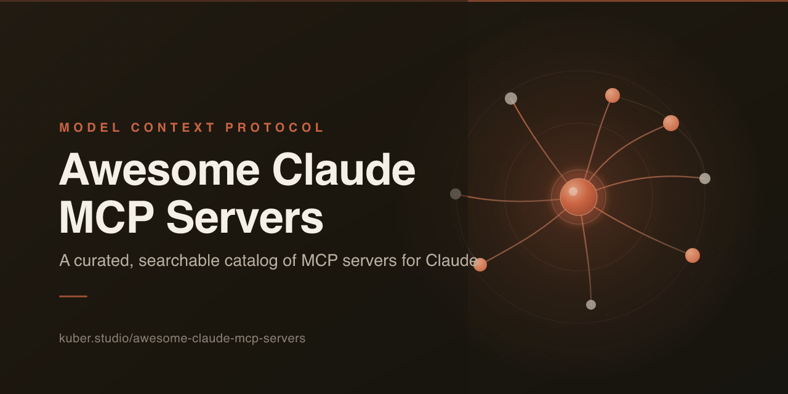

# Awesome Claude MCP Servers [](https://awesome.re)

[](https://kuber.studio/awesome-claude-mcp-servers/)

**Übersetzungen:** [English](README.md) · [简体中文](README.zh-CN.md) · [繁體中文](README.zh-TW.md) · [日本語](README.ja.md) · [한국어](README.ko.md) · [Español](README.es.md) · [Français](README.fr.md) · Deutsch · [Português](README.pt-BR.md) · [add yours →](CONTRIBUTING.md#translations)

> _Dies ist eine Community-Übersetzung der englischen [README](README.md); die englische Fassung ist maßgeblich und kann aktueller sein._

> Ein kuratierter, nüchterner Katalog von Model-Context-Protocol-(MCP-)Servern, die **Claude** Hände und Augen geben — über Claude Desktop, Claude Code und die Claude API hinweg.

**[Zum durchsuchbaren Verzeichnis →](https://kuber.studio/awesome-claude-mcp-servers/)** — suchen, nach Kategorie, Sprache und Hosting filtern und mit einem Klick ein Konfigurations-Snippet abgreifen.

Das [Model Context Protocol](https://modelcontextprotocol.io) ist ein offener Standard, um KI-Anwendungen mit externen Werkzeugen, Daten und Diensten zu verbinden. Claude ist der **Client (Host)**; jeder der folgenden Server stellt Werkzeuge, Ressourcen oder Prompts bereit, die Claude aufrufen kann. Da MCP ein Standard ist, funktionieren die meisten dieser Server auch in Cursor, Codex und anderen Clients — es ändert sich lediglich das Format der Konfiguration. Wenn du OpenAI Codex nutzt, wirf einen Blick auf die Schwesterliste: **[awesome-codex-mcp-servers](https://github.com/Kuberwastaken/awesome-codex-mcp-servers)**.

Diese Liste setzt auf **Substanz statt Masse**: Server, die tatsächlich genutzt werden, die gepflegt werden und die eine Sache gut erledigen. Jeder Eintrag ist getaggt, sodass du auf einen Blick nach Sprache, Ausführungsort und Urheberschaft filtern kannst.

## Inhalt

- [So liest du diese Liste](#so-liest-du-diese-liste)
- [Erste Schritte mit Claude](#erste-schritte-mit-claude)
- [Starter-Kits](#starter-kits)
- [Sicherheit und gute Praxis](#sicherheit-und-gute-praxis)
- [Aggregatoren und Gateways](#aggregatoren-und-gateways)
- [Entwicklerwerkzeuge und Versionskontrolle](#entwicklerwerkzeuge-und-versionskontrolle)
- [Browser-Automatisierung](#browser-automatisierung)
- [Websuche und Scraping](#websuche-und-scraping)
- [Datenbanken und Data Warehouses](#datenbanken-und-data-warehouses)
- [Wissen und Gedächtnis](#wissen-und-gedächtnis)
- [Dateien und Dokumentenverarbeitung](#dateien-und-dokumentenverarbeitung)
- [Cloud, Infrastruktur und DevOps](#cloud-infrastruktur-und-devops)
- [Monitoring und Observability](#monitoring-und-observability)
- [Sicherheit](#sicherheit)
- [Kommunikation](#kommunikation)
- [Produktivität und Projektmanagement](#produktivität-und-projektmanagement)
- [Finanzen und Zahlungen](#finanzen-und-zahlungen)
- [Design und Kreatives](#design-und-kreatives)
- [KI, Daten und Analytik](#ki-daten-und-analytik)
- [Karten und Standort](#karten-und-standort)
- [Medien und Unterhaltung](#medien-und-unterhaltung)
- [Wissenschaft und Forschung](#wissenschaft-und-forschung)
- [Alles Weitere](#alles-weitere)
- [Verwandte Listen](#verwandte-listen)
- [Mitwirken](#mitwirken)

## So liest du diese Liste

Jeder Eintrag sieht so aus:

```
- [Name](Link) - Was er tut, in einem einzigen schlichten Satz. `Sprache` `Ausführung` `Quelle`
```

Die nachgestellten Tags sind die Metadaten zum schnellen Überfliegen:

**Sprache** — `TS` TypeScript · `Py` Python · `Go` Go · `Rust` Rust · `C#` C# · `Java` Java · `JS` JavaScript · `Ruby` Ruby

**Ausführung** — `local` läuft als Subprozess über stdio auf deinem Rechner · `remote` ein gehosteter HTTP-Endpunkt, auf den du Claude verweist · `local/remote` bringt beides mit

**Quelle** — `reference` ein offizieller Referenzserver aus dem MCP-Projekt · `official` gepflegt vom Hersteller des Produkts selbst · `archived` ein archivierter Referenzserver, weiterhin nutzbar, aber nicht mehr gepflegt. Einträge ohne Quellen-Tag werden von der Community gepflegt.

Keine Sterne, keine Installationszahlen — die sind schon am Tag ihrer Eingabe veraltet. Beliebtheit findet stattdessen in den [Starter-Kits](#starter-kits) ihren Platz.

## Erste Schritte mit Claude

MCP-Server verbinden sich über zwei Transportwege: **stdio** (ein lokaler Subprozess) und **streamable HTTP** (ein entfernter Endpunkt, optional hinter OAuth). So bindest du sie in die jeweilige Claude-Oberfläche ein.

### Claude Code (CLI)

Füge einen **lokalen (stdio-)** Server hinzu. Alles nach `--` wird unverändert an den Server weitergereicht:

```bash
claude mcp add filesystem -- npx -y @modelcontextprotocol/server-filesystem ~/Projects
```

Füge einen **entfernten (HTTP-)** Server hinzu, mit optionalem Auth-Header:

```bash
claude mcp add --transport http notion https://mcp.notion.com/mcp
claude mcp add --transport http secure-api https://api.example.com/mcp \
  --header "Authorization: Bearer <token>"
```

Übergib Umgebungsvariablen an einen lokalen Server (achte darauf, zwischen `--env` und dem Namen eine Option zu belassen):

```bash
claude mcp add --env AIRTABLE_API_KEY=<key> --transport stdio airtable \
  -- npx -y airtable-mcp-server
```

Wähle mit `--scope`, **wo** ein Server gespeichert wird:

| Scope | Verfügbar in | Mit deinem Team geteilt | Gespeichert in |
|-------|--------------|----------------------|-----------|
| `local` (Standard) | im aktuellen Projekt, nur du | nein | `~/.claude.json` |
| `project` | im aktuellen Projekt, alle | ja, per Commit | `.mcp.json` im Repo |
| `user` | alle deine Projekte | nein | `~/.claude.json` |

Eine eingecheckte **`.mcp.json`** (Projekt-Scope) sieht so aus und wandert mit dem Repo mit:

```json
{
  "mcpServers": {
    "filesystem": {
      "command": "npx",
      "args": ["-y", "@modelcontextprotocol/server-filesystem", "."]
    },
    "sentry": {
      "type": "http",
      "url": "https://mcp.sentry.dev/mcp"
    }
  }
}
```

Verwalte, was du hinzugefügt hast: `claude mcp list`, `claude mcp get <name>`, `claude mcp remove <name>`. Innerhalb einer Sitzung zeigt `/mcp` den Live-Status, die Anzahl der Werkzeuge und den OAuth-Zustand. Für entfernte Server, die eine Anmeldung erfordern, führe `/mcp` aus und schließe den Browser-Ablauf ab (oder `claude mcp login <name>` in der Shell).

### Claude Desktop

Bearbeite die Konfiguration direkt — **Einstellungen → Entwickler → Konfiguration bearbeiten** — und beende Claude anschließend vollständig und starte es neu.

- macOS: `~/Library/Application Support/Claude/claude_desktop_config.json`
- Windows: `%APPDATA%\Claude\claude_desktop_config.json`

```json
{
  "mcpServers": {
    "filesystem": {
      "command": "npx",
      "args": [
        "-y",
        "@modelcontextprotocol/server-filesystem",
        "/Users/you/Desktop",
        "/Users/you/Downloads"
      ]
    }
  }
}
```

Verwende in `args` **absolute Pfade**, niemals relative. Die Logs liegen unter `~/Library/Logs/Claude/` (macOS) oder `%APPDATA%\Claude\logs` (Windows). Entfernte bzw. OAuth-Server fügst du am besten über die in Claude Desktop integrierte **Connectors**-Oberfläche hinzu, statt sie hier von Hand einzutragen.

### Claude API

Claude-Modelle rufen MCP-Werkzeuge über den [MCP-Connector](https://docs.claude.com/en/docs/agents-and-tools/mcp-connector) (entfernte Server) oder das [Agent SDK](https://docs.claude.com/en/api/agent-sdk/overview) auf, das dieselben Server-Konfigurationen wie Claude Code versteht.

## Starter-Kits

Du willst keine dreißig Server. Werkzeugdefinitionen zehren am selben Kontextfenster wie deine eigentliche Arbeit, und jenseits von etwa 40 aktiven Werkzeugen greift das Modell zunehmend zum falschen. Installiere eine kleine Auswahl, die zu deiner Aufgabe passt.

**Der Coding-Stack** — worauf sich die meisten Claude-Code-Nutzer einpendeln:

- [Context7](https://github.com/upstash/context7) - aktuelle, versionsgebundene Bibliotheksdokumentation, damit Claude nicht mehr bei APIs raten muss.
- [GitHub](https://github.com/github/github-mcp-server) - Issues, PRs, Codesuche und Actions, damit Claude am Repo mitwirkt.
- [Playwright](https://github.com/microsoft/playwright-mcp) - einen Browser für UI-Arbeit und End-to-End-Prüfungen steuern und verifizieren.
- [Serena](https://github.com/oraios/serena) - Codenavigation und -bearbeitung auf Symbolebene für große Codebasen.
- [Sentry](https://github.com/getsentry/sentry-mcp) - echte Produktionsfehler und Stacktraces abrufen, während du sie behebst.

> Claude Code bringt bereits starke integrierte Datei-, Shell- und Git-Werkzeuge mit. Ein Filesystem- oder Git-MCP-Server ist dort weitgehend überflüssig — füge sie für **Claude Desktop** hinzu, wo es diese eingebauten Werkzeuge nicht gibt.

**Der Wissens-Stack** — für Recherche, Schreiben und persönliche Automatisierung in Claude Desktop:

- [Fetch](https://github.com/modelcontextprotocol/servers/tree/main/src/fetch) - jede URL in sauberes Markdown verwandeln.
- [Brave Search](https://github.com/brave/brave-search-mcp-server) - Echtzeit-Verankerung im Web.
- [Filesystem](https://github.com/modelcontextprotocol/servers/tree/main/src/filesystem) - Claude lokale Dateien lesen und schreiben lassen.
- [Memory](https://github.com/modelcontextprotocol/servers/tree/main/src/memory) - Fakten über Sitzungen hinweg speichern.
- [Notion](https://github.com/makenotion/notion-mcp-server) oder [Obsidian](https://github.com/MarkusPfundstein/mcp-obsidian) - deine Wissensdatenbank anbinden.

## Sicherheit und gute Praxis

MCP gibt einem Modell echte Fähigkeiten in die Hand. Behandle jeden Server wie eine Abhängigkeit, die du mitsamt Zugangsdaten installierst.

- **Installiere nur Server, denen du vertraust.** Ein bösartiger Server kann Anweisungen in seinen Werkzeugbeschreibungen verstecken (Tool Poisoning) und sie ändern, nachdem du ihn freigegeben hast. Bevorzuge `reference`- und `official`-Server oder lies den Quellcode.
- **Beschränke Zugangsdaten so weit wie möglich.** Gib Datenbank- und API-Servern **nur Lesezugriff** auf alles Produktive und verwende feingranulare Token nach dem Least-Privilege-Prinzip. Ein GitHub-PAT für einen Agenten sollte nicht force-pushen können.
- **Prompt Injection ist real.** Ein Server, der externe Inhalte liest — ein GitHub-Issue, eine Webseite, eine E-Mail — kann Anweisungen enthalten, die versuchen, Claude zu kapern. Halte schreibfähige und inhaltslesende Server nach Möglichkeit getrennt.
- **Behalte das Token-Budget im Blick.** Die Werkzeugdefinitionen jedes Servers kosten Kontext, bevor überhaupt Arbeit passiert; manche großen Server verschlingen Zehntausende Tokens. Wenige, treffsichere Server schlagen das Rundum-sorglos-Paket.
- **Fixiere Versionen.** Fixiere bei allem Sensiblen die Paketversionen von `npx`/`uvx` und binde lokale HTTP-Server an `127.0.0.1`.

## Aggregatoren und Gateways

Betreibe und verwalte viele Server hinter einem einzigen Endpunkt — Routing, Authentifizierung, Werkzeugfilterung und Namespacing.

- [MetaMCP](https://github.com/metatool-ai/metamcp) - Bündelt MCP-Server zu namespaced Endpunkten mit Middleware, Authentifizierung und GUI. `TS` `local/remote`
- [Docker MCP Gateway](https://github.com/docker/mcp-gateway) - Betreibt und verwaltet MCP-Server als isolierte, signierte Docker-Container. `Go` `local/remote` `official`
- [mcp-proxy](https://github.com/sparfenyuk/mcp-proxy) - Überbrückt stdio und SSE/streamable-HTTP, damit jeder Server jeden Client erreicht. `Py` `local`
- [MCP Context Forge](https://github.com/IBM/mcp-context-forge) - Führt REST-, MCP- und A2A-Werkzeuge hinter einem einzigen Gateway zusammen. `Py` `remote`
- [agentgateway](https://github.com/agentgateway/agentgateway) - Data-Plane-Proxy für Agenten und MCP mit Sicherheits- und Governance-Kontrollen. `Rust` `remote`
- [Klavis](https://github.com/Klavis-AI/klavis) - Gehostete oder selbst gehostete Plattform, die MCP-Integrationen im großen Maßstab bereitstellt und verwaltet. `Py` `local/remote`
- [Unla](https://github.com/AmoyLab/Unla) - Leichtgewichtiges Gateway, das bestehende MCP-Server in verwaltete Endpunkte verwandelt. `Go` `remote`
- [MCP Router](https://github.com/mcp-router/mcp-router) - Desktop-App, die lokale MCP-Server routet, verwaltet und bündelt. `TS` `local`
- [MCPJungle](https://github.com/mcpjungle/MCPJungle) - Selbst gehostete MCP-Registry und -Proxy für Agentenflotten im Unternehmen. `Go` `remote`
- [Nexus](https://github.com/grafbase/nexus) - Gateway, das MCP-Server und LLM-Anbieter hinter einer API bündelt. `Rust` `remote`
- [1MCP](https://github.com/1mcp-app/agent) - Bündelt mehrere MCP-Server zu einem einzigen einheitlichen Endpunkt. `TS` `local/remote`
- [Magg](https://github.com/sitbon/magg) - Meta-MCP-Hub zur autonomen Entdeckung, Installation und Orchestrierung von Servern. `Py` `local`
- [mcgravity](https://github.com/tigranbs/mcgravity) - Proxy, der viele MCP-Server zu einem lastverteilten Endpunkt zusammenfasst. `TS` `local`
- [pluggedin-mcp](https://github.com/VeriTeknik/pluggedin-mcp) - Vereint Server mit Werkzeug- und Ressourcenerkennung samt Playground. `TS` `local`

## Entwicklerwerkzeuge und Versionskontrolle

- [GitHub](https://github.com/github/github-mcp-server) - Verwaltet Repositories, Issues, Pull Requests, Codesuche und Actions. `Go` `local/remote` `official`
- [Git](https://github.com/modelcontextprotocol/servers/tree/main/src/git) - Liest, durchsucht und bearbeitet lokale Git-Repositories. `Py` `local` `reference`
- [Serena](https://github.com/oraios/serena) - Codeabruf und -bearbeitung auf Symbolebene, angetrieben von Language-Servern. `Py` `local`
- [Context7](https://github.com/upstash/context7) - Fügt aktuelle, versionsspezifische Bibliotheksdokumentation in Prompts ein. `TS` `local/remote` `official`
- [Desktop Commander](https://github.com/wonderwhy-er/DesktopCommanderMCP) - Terminalsteuerung und diff-basierte Dateibearbeitung auf deinem gesamten Rechner. `TS` `local`
- [GitLab Duo](https://docs.gitlab.com/user/gitlab_duo/model_context_protocol/mcp_server/) - Integrierter GitLab-Endpunkt für Projekte, Issues, Merge Requests und Pipelines. `Ruby` `remote` `official`
- [E2B](https://github.com/e2b-dev/mcp-server) - Führt LLM-generierten Code in sicheren Cloud-Sandboxes aus. `TS` `local/remote` `official`
- [Postman](https://github.com/postmanlabs/postman-mcp-server) - Verbindet Agenten mit APIs, Collections und Umgebungen in Postman. `TS` `local/remote` `official`
- [CircleCI](https://github.com/CircleCI-Public/mcp-server-circleci) - Lässt Agenten fehlgeschlagene CI-Builds diagnostizieren und beheben. `TS` `local` `official`
- [Buildkite](https://github.com/buildkite/buildkite-mcp-server) - Verwaltet Buildkite-Pipelines, -Builds und -Jobs. `Go` `local` `official`
- [Azure DevOps](https://github.com/microsoft/azure-devops-mcp) - Greift auf Azure-DevOps-Boards, -Repos und -Pipelines zu. `TS` `local` `official`
- [GitKraken](https://github.com/gitkraken/gk-cli) - CLI und MCP als Hülle um GitKraken, Jira, GitHub und GitLab. `TS` `local` `official`
- [MCP Language Server](https://github.com/isaacphi/mcp-language-server) - Gibt Agenten semantische Code-Werkzeuge: Definitionen, Referenzen und Diagnosen. `Go` `local`
- [Gitee](https://github.com/oschina/mcp-gitee) - Repository-, Issue- und Pull-Request-Verwaltung für Gitee. `TS` `local` `official`

## Browser-Automatisierung

- [Playwright](https://github.com/microsoft/playwright-mcp) - Steuert einen Browser über den Accessibility-Baum statt über Screenshots. `TS` `local/remote` `official`
- [Chrome DevTools](https://github.com/ChromeDevTools/chrome-devtools-mcp) - Steuert und inspiziert ein laufendes Chrome für Automatisierung, Debugging und Performance-Tracing. `TS` `local` `official`
- [browser-use](https://github.com/browser-use/browser-use) - Lässt Agenten einen echten Browser steuern, um Daten zu extrahieren und Aufgaben zu erledigen. `Py` `local`
- [Browserbase](https://github.com/browserbase/mcp-server-browserbase) - Steuert einen Cloud-Browser über die Browserbase-Infrastruktur und Stagehand. `TS` `local/remote` `official`
- [Stagehand](https://github.com/browserbase/stagehand) - KI-Framework zur Browser-Automatisierung mit den Primitiven act, extract und observe. `TS` `local/remote` `official`
- [Browser MCP](https://github.com/browsermcp/mcp) - Automatisiert dein lokales Chrome über eine begleitende Browser-Erweiterung. `TS` `local`
- [Playwright (ExecuteAutomation)](https://github.com/executeautomation/mcp-playwright) - Community-Playwright-Automatisierung samt Web-Scraping-Werkzeugen. `TS` `local`
- [Skyvern](https://github.com/Skyvern-AI/skyvern) - Automatisiert Browser-Workflows mit LLMs und Computer Vision. `Py` `local/remote`
- [Hyperbrowser](https://github.com/hyperbrowserai/mcp) - Cloud-Browser-Plattform für Scraping und Automatisierung durch Agenten. `TS` `local/remote` `official`
- [Selenium](https://github.com/angiejones/mcp-selenium) - Browser-Automatisierung über den Selenium WebDriver. `JS` `local`
- [Puppeteer](https://github.com/modelcontextprotocol/servers-archived/tree/main/src/puppeteer) - Browser-Automatisierung und Scraping über Puppeteer. `TS` `local` `archived`

## Websuche und Scraping

- [Fetch](https://github.com/modelcontextprotocol/servers/tree/main/src/fetch) - Ruft eine URL ab und wandelt ihren Inhalt in Markdown um. `Py` `local` `reference`
- [Firecrawl](https://github.com/firecrawl/firecrawl-mcp-server) - Scrapt, crawlt und extrahiert strukturierte Webdaten für LLMs. `TS` `local/remote` `official`
- [Exa](https://github.com/exa-labs/exa-mcp-server) - Neuronale Websuche, Crawling und Unternehmensrecherche für Agenten. `TS` `local/remote` `official`
- [Tavily](https://github.com/tavily-ai/tavily-mcp) - Echtzeit-Suche, -Extraktion, -Mapping und -Crawling, abgestimmt auf Agenten. `TS` `local/remote` `official`
- [Brave Search](https://github.com/brave/brave-search-mcp-server) - Web-, Lokal-, Bild-, Video- und Nachrichtensuche über die Brave-API. `TS` `local/remote` `official`
- [Perplexity](https://github.com/ppl-ai/modelcontextprotocol) - Echtzeit-Webrecherche über die Perplexity-Sonar-Modelle. `TS` `local/remote` `official`
- [Kagi](https://github.com/kagisearch/kagimcp) - Zugriff auf die Such- und Zusammenfassungs-API von Kagi. `Py` `local` `official`
- [DuckDuckGo](https://github.com/nickclyde/duckduckgo-mcp-server) - Websuche und Seitenabruf über DuckDuckGo, ohne API-Schlüssel. `Py` `local`
- [SearXNG](https://github.com/ihor-sokoliuk/mcp-searxng) - Fragt eine selbst gehostete SearXNG-Metasuchinstanz ab. `Py` `local`
- [Apify](https://github.com/apify/actors-mcp-server) - Führt Tausende Scraper und Actors aus dem Apify Store für Webdaten aus. `TS` `local/remote` `official`
- [Bright Data](https://github.com/brightdata/brightdata-mcp) - Web-Unlocker-, SERP- und Scraping-Toolkit. `JS` `local/remote` `official`
- [Crawl4AI](https://github.com/unclecode/crawl4ai) - Quelloffener, LLM-freundlicher Crawler mit integriertem MCP-Endpunkt. `Py` `local`
- [Oxylabs](https://github.com/oxylabs/oxylabs-mcp) - Scraping-API mit dynamischem Rendering und Geo-Targeting. `Py` `local/remote` `official`

## Datenbanken und Data Warehouses

- [PostgreSQL Pro](https://github.com/crystaldba/postgres-mcp) - Schema-bewusster Postgres-Zugriff mit Health-Checks und sicherem SQL. `Py` `local`
- [SQLite](https://github.com/modelcontextprotocol/servers-archived/tree/main/src/sqlite) - Fragt SQLite-Datenbanken ab und verwaltet sie. `Py` `local` `archived`
- [MySQL](https://github.com/designcomputer/mysql_mcp_server) - MySQL-Zugriff mit konfigurierbaren Berechtigungen und Schema-Inspektion. `Py` `local`
- [MongoDB](https://github.com/mongodb-js/mongodb-mcp-server) - Verbindet Agenten mit MongoDB-Datenbanken und Atlas-Clustern. `TS` `local/remote` `official`
- [Redis](https://github.com/redis/mcp-redis) - Natürlichsprachliche Schnittstelle zum Verwalten und Durchsuchen von Redis-Daten. `Py` `local` `official`
- [Supabase](https://github.com/supabase/mcp) - Verwaltet Supabase Postgres, Auth, Storage und Edge Functions. `TS` `local/remote` `official`
- [Neon](https://github.com/neondatabase/mcp-server-neon) - Verwaltet Neon-Serverless-Postgres-Projekte, -Branches und -Abfragen. `TS` `local/remote` `official`
- [ClickHouse](https://github.com/ClickHouse/mcp-clickhouse) - Erkundet Datenbanken und führt Read-only-SQL gegen ClickHouse aus. `Py` `local/remote` `official`
- [BigQuery](https://github.com/LucasHild/mcp-server-bigquery) - Fragt BigQuery mit Schema-Inspektion und SQL-Ausführung ab. `Py` `local`
- [Snowflake](https://github.com/isaacwasserman/mcp-snowflake-server) - Fragt Snowflake mit Lese-/Schreibzugriff und Insight-Tracking ab. `Py` `local`
- [DuckDB](https://github.com/ktanaka101/mcp-server-duckdb) - DuckDB-Zugriff mit Schema-Inspektion und Read-only-Modus. `Py` `local`
- [MotherDuck](https://github.com/motherduckdb/mcp-server-motherduck) - Fragt Daten mit MotherDuck und lokalem DuckDB ab. `Py` `local/remote` `official`
- [Prisma](https://github.com/prisma/mcp) - Verwaltet Prisma-Datenbanken und führt Migrationen aus. `TS` `local/remote` `official`
- [Neo4j](https://github.com/neo4j-contrib/mcp-neo4j) - Erkundet Schemata und führt Cypher gegen Neo4j-Graphdatenbanken aus. `Py` `local` `official`
- [Airtable](https://github.com/domdomegg/airtable-mcp-server) - Liest und schreibt Airtable-Base-Datensätze mit Schema-Inspektion. `TS` `local`
- [NocoDB](https://github.com/edwinbernadus/nocodb-mcp-server) - Liest und schreibt NocoDB-Datenbankdatensätze. `JS` `local`
- [Elasticsearch](https://github.com/elastic/mcp-server-elasticsearch) - Natürlichsprachliche Suche über Elasticsearch-Daten. `TS` `local` `official`
- [Tinybird](https://github.com/tinybirdco/mcp-tinybird) - Fragt die Serverless-ClickHouse-Analytics-Plattform Tinybird ab. `Py` `local` `official`

## Wissen und Gedächtnis

- [Memory](https://github.com/modelcontextprotocol/servers/tree/main/src/memory) - Persistentes Wissensgraph-Gedächtnis über Sitzungen hinweg. `TS` `local` `reference`
- [Basic Memory](https://github.com/basicmachines-co/basic-memory) - Local-first-Markdown-Wissensdatenbank mit persistentem semantischem Gedächtnis. `Py` `local`
- [mem0](https://github.com/coleam00/mcp-mem0) - Persistentes Langzeitgedächtnis für Agenten auf Basis von mem0. `Py` `local`
- [Memento](https://github.com/gannonh/memento-mcp) - Neo4j-gestütztes Wissensgraph-Gedächtnis mit zeitlichem Bewusstsein. `TS` `local`
- [Reference](https://github.com/Kuberwastaken/reference) - Durchsucht und ruft vergangene Sitzungen und Erinnerungen über Claude, Codex und andere KI-Werkzeuge hinweg ab. `Py` `local`
- [Qdrant](https://github.com/qdrant/mcp-server-qdrant) - Speichert und ruft semantische Erinnerungen in der Qdrant-Vektor-Engine ab. `Py` `local/remote` `official`
- [Chroma](https://github.com/chroma-core/chroma-mcp) - Vektor-, Volltext- und Metadatensuche über Chroma-Collections. `Py` `local` `official`
- [Milvus](https://github.com/zilliztech/mcp-server-milvus) - Vektor-, Text- und Hybridsuche auf der Milvus-Datenbank. `Py` `local/remote` `official`
- [Pinecone](https://github.com/pinecone-io/pinecone-mcp) - Durchsucht Dokumente, verwaltet Indizes und fragt Daten in Pinecone ab. `TS` `local` `official`
- [Obsidian](https://github.com/MarkusPfundstein/mcp-obsidian) - Liest, durchsucht und bearbeitet Notizen in einem Obsidian-Vault. `Py` `local`
- [Apple Notes](https://github.com/sirmews/apple-notes-mcp) - Liest aus der lokalen Apple-Notes-Datenbank unter macOS. `Py` `local`
- [Logseq](https://github.com/apw124/logseq-mcp) - Interagiert mit einem Logseq-Wissensgraphen. `Py` `local`
- [Graphlit](https://github.com/graphlit/graphlit-mcp-server) - Nimmt Inhalte aus Slack, Gmail und dem Web in eine durchsuchbare Wissensdatenbank auf. `TS` `local/remote` `official`

## Dateien und Dokumentenverarbeitung

- [Filesystem](https://github.com/modelcontextprotocol/servers/tree/main/src/filesystem) - Sichere lokale Dateioperationen mit konfigurierbaren Zugriffskontrollen. `TS` `local` `reference`
- [Filesystem (Go)](https://github.com/mark3labs/mcp-filesystem-server) - Go-Implementierung des lokalen Dateisystemzugriffs. `Go` `local`
- [Everything Search](https://github.com/mamertofabian/mcp-everything-search) - Schnelle lokale Dateisuche unter Windows, macOS und Linux. `Py` `local`
- [Google Drive](https://github.com/modelcontextprotocol/servers-archived/tree/main/src/gdrive) - Dateizugriff und -suche für Google Drive. `TS` `local` `archived`
- [Microsoft 365](https://github.com/softeria/ms-365-mcp-server) - Greift über die Graph-API auf Dateien, Mail und Kalender von Microsoft 365 zu. `TS` `local`
- [Box](https://github.com/hmk/box-mcp-server) - Durchsucht und liest Dateien in Box. `JS` `local`
- [Pandoc](https://github.com/vivekVells/mcp-pandoc) - Konvertiert Dokumente zwischen Markdown, HTML, PDF und docx. `Py` `local`
- [Unstructured](https://github.com/Unstructured-IO/UNS-MCP) - Baut Workflows zum Parsen und Einlesen von Dokumenten. `Py` `local/remote` `official`
- [Cloudinary](https://github.com/cloudinary/mcp-servers) - Lädt Medien-Assets hoch, transformiert, analysiert und organisiert sie. `TS` `local/remote` `official`
- [llm-context](https://github.com/cyberchitta/llm-context.py) - Teilt Code- und Dateikontext mit LLMs über MCP oder die Zwischenablage. `Py` `local`

## Cloud, Infrastruktur und DevOps

- [AWS](https://github.com/awslabs/mcp) - Server-Suite für AWS-Dienste, CDK, Kosten, Dokumentation und Bedrock. `Py` `local/remote` `official`
- [Azure](https://github.com/microsoft/mcp) - Greift mit Entra-ID-Authentifizierung auf Azure-Dienste zu. `C#` `local` `official`
- [Cloudflare](https://github.com/cloudflare/mcp-server-cloudflare) - Entfernte Server über Cloudflares Entwicklung, Observability und Sicherheit hinweg. `TS` `remote` `official`
- [Google Cloud Run](https://github.com/GoogleCloudPlatform/cloud-run-mcp) - Deployt Anwendungen auf Google Cloud Run. `TS` `local` `official`
- [Terraform](https://github.com/hashicorp/terraform-mcp-server) - Interagiert mit der Terraform-Registry und den HCP-Terraform-APIs. `Go` `local/remote` `official`
- [Pulumi](https://www.pulumi.com/docs/ai/mcp-server/) - Führt Pulumi-Infrastructure-as-Code-Operationen über die Automation- und Cloud-APIs aus. `TS` `local` `official`
- [Kubernetes](https://github.com/Flux159/mcp-server-kubernetes) - Verwaltet Pods, Deployments und Services in Kubernetes. `TS` `local`
- [mcp-k8s-go](https://github.com/strowk/mcp-k8s-go) - Kubernetes-Cluster-Operationen: Pods, Logs und Events. `Go` `local`
- [Docker](https://github.com/QuantGeekDev/docker-mcp) - Verwaltet Container und Compose-Stacks. `Py` `local`
- [Heroku](https://github.com/heroku/heroku-mcp-server) - Verwaltet Heroku-Apps, Postgres und Add-ons. `TS` `local` `official`
- [Netlify](https://github.com/netlify/netlify-mcp) - Erstellt, baut, deployt und verwaltet Netlify-Sites. `TS` `local` `official`
- [Nomad](https://github.com/kocierik/mcp-nomad) - Verwaltet HashiCorp-Nomad-Jobs und -Cluster. `Go` `local`
- [Hetzner Cloud](https://github.com/dkruyt/mcp-hetzner) - Interagiert mit der Hetzner-Cloud-API. `TS` `local`

## Monitoring und Observability

- [Sentry](https://github.com/getsentry/sentry-mcp) - Ruft Issues, Stacktraces und Seer-KI-Analysen ab. `TS` `local/remote` `official`
- [Grafana](https://github.com/grafana/mcp-grafana) - Greift auf Dashboards, Datenquellen, Alerts und Incidents zu. `Go` `local/remote` `official`
- [Axiom](https://github.com/axiomhq/mcp) - Fragt Observability-Daten mit der Axiom Processing Language ab. `TS` `remote` `official`
- [Logfire](https://github.com/pydantic/logfire-mcp) - Greift über Pydantic Logfire auf OpenTelemetry-Traces und -Metriken zu. `Py` `local` `official`
- [VictoriaMetrics](https://github.com/VictoriaMetrics-Community/mcp-victoriametrics) - Fragt VictoriaMetrics-Metriken und -Observability-Daten ab. `Go` `local`
- [SigNoz](https://github.com/DrDroidLab/signoz-mcp-server) - Fragt SigNoz-Metriken, -Traces und -Dashboards ab. `Py` `local`
- [Raygun](https://github.com/MindscapeHQ/mcp-server-raygun) - Greift auf Crash-Reporting- und Real-User-Monitoring-Daten zu. `TS` `local` `official`
- [Loki](https://github.com/scottlepp/loki-mcp) - Fragt Log-Daten aus Grafana Loki ab. `Go` `local`

## Sicherheit

- [Semgrep](https://github.com/semgrep/mcp) - Scannt Code mit Semgrep auf Sicherheitslücken. `Py` `local/remote` `official`
- [OSV](https://github.com/StacklokLabs/osv-mcp) - Fragt die Open-Source-Vulnerabilities-Datenbank ab. `Go` `local`
- [Snyk](https://github.com/sammcj/mcp-snyk) - Scannt Repositories und Projekte über die Snyk-CLI. `TS` `local`
- [Burp Suite](https://github.com/PortSwigger/mcp-server) - Bindet Burp Suite für Web-Sicherheitstests ein. `Py` `local` `official`
- [HashiCorp Vault](https://github.com/hashicorp/vault-mcp-server) - Verwaltet Secrets und Richtlinien in HashiCorp Vault. `Go` `local` `official`
- [Auth0](https://github.com/auth0/auth0-mcp-server) - Verwaltet Auth0-Tenants per natürlicher Sprache. `TS` `local` `official`
- [GhidraMCP](https://github.com/LaurieWired/GhidraMCP) - Reverse-Engineering von Binärdateien über die Ghidra-Dekompilierung. `Java` `local`
- [IDA Pro](https://github.com/mrexodia/ida-pro-mcp) - Automatisiert Reverse Engineering mit IDA Pro. `Py` `local`
- [Shodan](https://github.com/BurtTheCoder/mcp-shodan) - Fragt Shodan-Netzwerkinformationen mit strukturierter Ausgabe ab. `Py` `local`
- [VirusTotal](https://github.com/BurtTheCoder/mcp-virustotal) - Analysiert Dateien und URLs über die VirusTotal-API. `Py` `local`
- [1Password](https://github.com/goodwokdev/op-mcp) - Greift auf die 1Password-CLI zu, um Secrets und Vaults zu verwalten. `Rust` `local`

## Kommunikation

- [Slack](https://github.com/korotovsky/slack-mcp-server) - Greift über stdio, SSE und HTTP mit intelligentem Verlauf auf Slack-Workspaces zu. `Go` `local/remote`
- [WhatsApp](https://github.com/lharries/whatsapp-mcp) - Durchsucht, liest und sendet persönliche WhatsApp-Nachrichten und -Medien. `Go` `local`
- [Gmail](https://github.com/GongRzhe/Gmail-MCP-Server) - Sendet, durchsucht und verwaltet Gmail mit automatischem OAuth. `TS` `local`
- [Telegram](https://github.com/chaindead/telegram-mcp) - Verwaltet Telegram-Dialoge, -Nachrichten und -Entwürfe über MTProto. `Go` `local`
- [Twilio](https://github.com/twilio-labs/mcp) - Sendet Nachrichten und verwaltet Telefonnummern über die Twilio-APIs. `TS` `local` `official`
- [LINE](https://github.com/line/line-bot-mcp-server) - Verbindet einen Agenten mit einem offiziellen LINE-Account. `TS` `local` `official`
- [Resend](https://github.com/Hawstein/resend-mcp) - Verfasst und versendet E-Mails über die Resend-API. `TS` `local`
- [Mailgun](https://github.com/mailgun/mailgun-mcp-server) - Interagiert mit der Mailgun-E-Mail-API für Versand und Analytik. `TS` `local` `official`
- [Bluesky](https://github.com/keturiosakys/bluesky-context-server) - Fragt und durchsucht Bluesky-Feeds und -Beiträge über das AT Protocol. `TS` `local`
- [Intercom](https://github.com/intercom/intercom-mcp-server) - Durchsucht Intercom-Konversationen und -Kontakte. `TS` `remote` `official`

## Produktivität und Projektmanagement

- [Notion](https://github.com/makenotion/notion-mcp-server) - Liest und schreibt Notion-Seiten, -Datenbanken, -Blöcke und -Kommentare. `TS` `local/remote` `official`
- [Linear](https://linear.app/docs/mcp) - Verwaltet Linear-Issues, -Projekte und -Zyklen. `remote` `official`
- [Atlassian](https://github.com/atlassian/atlassian-mcp-server) - Greift über OAuth auf Jira, Confluence und Bitbucket zu. `remote` `official`
- [Atlassian (community)](https://github.com/sooperset/mcp-atlassian) - Selbst hostbare Jira- und Confluence-Integration. `Py` `local`
- [Asana](https://developers.asana.com/docs/using-asanas-mcp-server) - Erstellt Aufgaben und durchsucht den Asana Work Graph. `remote` `official`
- [monday.com](https://github.com/mondaycom/mcp) - Greift auf monday.com-Boards, -Items und -Workflows zu. `TS` `local/remote` `official`
- [ClickUp](https://github.com/taazkareem/clickup-mcp-server) - Verwaltet ClickUp-Aufgaben, -Dokumente, -Zeiterfassung und -Kommentare. `TS` `local`
- [Todoist](https://github.com/abhiz123/todoist-mcp-server) - Verwaltet Todoist-Aufgaben per natürlicher Sprache. `TS` `local`
- [Trello](https://github.com/m0xai/trello-mcp-server) - Arbeitet mit Trello-Boards, -Listen und -Karten. `TS` `local`
- [Google Calendar](https://github.com/nspady/google-calendar-mcp) - Verwaltet Google-Calendar-Termine mit Konflikterkennung. `TS` `local`
- [Apple Reminders](https://github.com/FradSer/mcp-server-apple-reminders) - Interagiert mit Apple Reminders unter macOS. `TS` `local`
- [Zapier](https://zapier.com/mcp) - Verbindet Agenten mit Tausenden Apps für Aktionen und Trigger. `remote` `official`
- [Taskade](https://github.com/taskade/mcp) - Verwaltet Taskade-Aufgaben, -Projekte und -Workspaces. `TS` `local/remote` `official`
- [Webflow](https://github.com/webflow/mcp-server) - Gestaltet, strukturiert und verwaltet Webflow-Sites über die Data-API. `TS` `local/remote` `official`

## Finanzen und Zahlungen

- [Stripe](https://github.com/stripe/agent-toolkit) - Verwaltet Zahlungen, Abrechnung und Kunden über die Stripe-API. `TS` `local/remote` `official`
- [PayPal](https://github.com/paypal/agent-toolkit) - Bearbeitet Rechnungen, Zahlungen, Streitfälle und Abonnements. `TS` `local/remote` `official`
- [Xero](https://github.com/XeroAPI/xero-mcp-server) - Verwaltet Rechnungen, Kontakte und Buchhaltungsdaten. `TS` `local` `official`
- [Chargebee](https://github.com/chargebee/agentkit) - Verbindet Agenten mit der Abo-Abrechnungsplattform Chargebee. `TS` `local` `official`
- [CoinGecko](https://github.com/coingecko/coingecko-typescript) - Krypto-Kurs- und Marktdaten über Coins und Börsen hinweg. `TS` `local/remote` `official`
- [Financial Datasets](https://github.com/financial-datasets/mcp-server) - Aktienmarkt- und Fundamentaldaten, gemacht für Agenten. `Py` `local`
- [Alpaca](https://github.com/cesarvarela/alpaca-mcp) - Handelt Aktien und Krypto über die Alpaca-APIs. `Py` `local`
- [CoinCap](https://github.com/QuantGeekDev/coincap-mcp) - Kryptomarktdaten in Echtzeit, ohne API-Schlüssel. `TS` `local`

## Design und Kreatives

- [Figma Dev Mode](https://developers.figma.com/docs/figma-mcp-server/) - Liefert Design-Kontext und Canvas-Zugriff aus Figma-Dateien. `local/remote` `official`
- [Figma Context](https://github.com/GLips/Figma-Context-MCP) - Speist Layout- und Styling-Daten aus Figma an Coding-Agenten. `TS` `local`
- [Blender](https://github.com/ahujasid/blender-mcp) - Steuert Blender für 3D-Modellierung und Szenenerstellung. `Py` `local`
- [AntV Chart](https://github.com/antvis/mcp-server-chart) - Erzeugt Diagramme mit der AntV-Visualisierungsbibliothek. `TS` `local` `official`
- [ECharts](https://github.com/hustcc/mcp-echarts) - Erzeugt Diagramme mit Apache ECharts. `TS` `local`
- [Mermaid](https://github.com/hustcc/mcp-mermaid) - Erzeugt Mermaid-Diagramme dynamisch. `TS` `local`
- [shadcn/ui](https://github.com/heilgar/shadcn-ui-mcp-server) - Durchsucht und installiert shadcn/ui-Komponenten. `TS` `local`
- [SlideSpeak](https://github.com/SlideSpeak/slidespeak-mcp) - Erstellt Präsentationen und PowerPoint-Decks mit KI. `Py` `local`

## KI, Daten und Analytik

- [Sequential Thinking](https://github.com/modelcontextprotocol/servers/tree/main/src/sequentialthinking) - Strukturiertes, revidierbares mehrstufiges Schlussfolgern. `TS` `local` `reference`
- [Hugging Face](https://github.com/huggingface/hf-mcp-server) - Greift auf Hugging-Face-Modelle, -Datensätze und -Spaces zu. `TS` `local/remote` `official`
- [Hugging Face Spaces](https://github.com/evalstate/mcp-hfspace) - Nutzt Hugging Face Spaces für Bild-, Audio- und Textmodelle. `TS` `local`
- [Google Analytics](https://github.com/googleanalytics/google-analytics-mcp) - Fragt GA4-Analytics-Daten ab. `Py` `local` `official`
- [MindsDB](https://github.com/mindsdb/mindsdb) - Fragt und vereinheitlicht Daten über Plattformen hinweg als ein einziger MCP-Server. `Py` `local/remote`
- [Vectorize](https://github.com/vectorize-io/vectorize-mcp-server) - Retrieval, Deep Research und Markdown-Extraktion über Vectorize. `JS` `local/remote` `official`
- [ZenML](https://github.com/zenml-io/mcp-zenml) - Fragt MLOps- und LLMOps-Pipelines in ZenML ab. `Py` `local` `official`
- [Chronulus AI](https://github.com/ChronulusAI/chronulus-mcp) - Multimodale Prognose und Vorhersage über beliebige Eingaben hinweg. `Py` `local`

## Karten und Standort

- [Google Maps](https://github.com/modelcontextprotocol/servers-archived/tree/main/src/google-maps) - Standortdienste, Routen und Ortsdetails. `TS` `local` `archived`
- [Mapbox](https://github.com/mapbox/mcp-server) - Geocoding, Navigation und Geodaten-Intelligenz über Mapbox. `TS` `local/remote` `official`
- [QGIS](https://github.com/jjsantos01/qgis_mcp) - Verbindet QGIS mit Agenten für Geodaten-Operationen. `Py` `local`
- [IPLocate](https://github.com/iplocate/mcp-server-iplocate) - IP-Geolokalisierung, Netzwerkinfos und Proxy-Erkennung. `TS` `local` `official`
- [AccuWeather](https://github.com/TimLukaHorstmann/mcp-weather) - Wettervorhersagen über die AccuWeather-API. `TS` `local`
- [Globalping](https://github.com/jsdelivr/globalping-mcp-server) - Führt Ping-, Traceroute- und DNS-Messungen von Standorten weltweit aus. `TS` `local` `official`

## Medien und Unterhaltung

- [ElevenLabs](https://github.com/elevenlabs/elevenlabs-mcp) - Text-to-Speech, Voice-Cloning und Audioverarbeitung. `Py` `local/remote` `official`
- [YouTube](https://github.com/anaisbetts/mcp-youtube) - Lädt YouTube-Untertitel und -Transkripte zur Analyse herunter. `TS` `local`
- [Spotify](https://github.com/varunneal/spotify-mcp) - Steuert die Wiedergabe und verwaltet Titel, Alben und Playlists. `Py` `local`
- [VideoDB](https://github.com/video-db/agent-toolkit) - Schneidet Videos, führt semantische Suche durch und transkribiert. `Py` `local/remote` `official`
- [Godot](https://github.com/Coding-Solo/godot-mcp) - Startet, betreibt und debuggt die Godot-Spiele-Engine. `TS` `local`
- [Unity](https://github.com/CoderGamester/mcp-unity) - Steuert den Unity-Editor und interagiert mit ihm. `C#` `local`
- [OP.GG](https://github.com/opgginc/opgg-mcp) - Echtzeit-Gaming-Statistiken zu populären Titeln. `TS` `local/remote` `official`

## Wissenschaft und Forschung

- [ArXiv](https://github.com/blazickjp/arxiv-mcp-server) - Durchsucht und analysiert arXiv-Forschungsarbeiten. `Py` `local`
- [BioMCP](https://github.com/genomoncology/biomcp) - Biomedizinische Recherche über PubMed und ClinicalTrials.gov. `Py` `local`
- [PapersWithCode](https://github.com/hbg/mcp-paperswithcode) - Durchsucht Forschungsarbeiten, Konferenzen und zugehörige Codebasen. `Py` `local`
- [OpenNutrition](https://github.com/deadletterq/mcp-opennutrition) - Durchsucht Lebensmittel, Nährwertangaben und Barcodes. `TS` `local`
- [gget](https://github.com/longevity-genie/gget-mcp) - Bioinformatik- und Genomik-Toolkit als Hülle um die gget-Bibliothek. `Py` `local`

## Alles Weitere

- [Time](https://github.com/modelcontextprotocol/servers/tree/main/src/time) - Zeit- und Zeitzonenumrechnung. `Py` `local` `reference`
- [Everything](https://github.com/modelcontextprotocol/servers/tree/main/src/everything) - Referenzserver, der jede MCP-Funktion durchspielt, zum Testen von Clients. `TS` `local` `reference`
- [Home Assistant](https://github.com/voska/hass-mcp) - Steuert Smart-Home-Geräte über Home Assistant. `Py` `local`
- [Coreflux MQTT](https://github.com/CorefluxCommunity/CorefluxMCPServer) - MQTT-Automatisierungs-Hub zur Interaktion mit IoT-Geräten. `C#` `local`
- [Congress](https://github.com/amurshak/congressMCP) - Fragt US-Gesetzgebungsdaten von Congress.gov ab. `Py` `local`
- [eSignatures](https://github.com/esignaturescom/mcp-server-esignatures) - Entwirft, prüft und versendet Verträge und Vorlagen. `Py` `local` `official`
- [ShopSavvy](https://github.com/shopsavvy/shopsavvy-mcp-server) - Schlägt Produktpreise per Barcode, ASIN oder URL nach. `TS` `local` `official`

## Verwandte Listen

- [Model Context Protocol](https://github.com/modelcontextprotocol) - Das offizielle Protokoll, die SDKs und Referenzserver.
- [MCP Registry](https://registry.modelcontextprotocol.io) - Die offizielle, namespaced Server-Registry (Vorschau).
- [awesome-codex-mcp-servers](https://github.com/Kuberwastaken/awesome-codex-mcp-servers) - Derselbe Katalog, zugeschnitten auf OpenAI Codex.

## Mitwirken

Einen Server gefunden, der hierher gehört, oder einen toten Link entdeckt? Beiträge sind willkommen — bitte lies zuerst die [Beitragsrichtlinien](CONTRIBUTING.md). Ein Projekt pro Pull Request, bleib sachlich und ordne es der richtigen Kategorie zu.

---

Diese Liste ist unter [CC0-1.0](LICENSE) der Gemeinfreiheit gewidmet. Nicht mit Anthropic affiliiert. „Claude“ ist eine Marke von Anthropic; hier nur zur Beschreibung der Kompatibilität verwendet.
